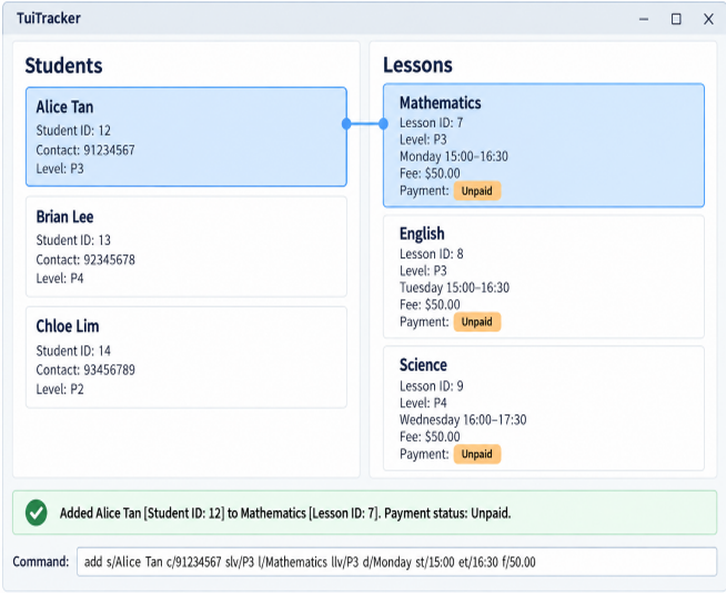

# TuiTracker

TuiTracker is a desktop application that helps private tutors manage their students, lessons, and monthly payments in 
one place. It combines a graphical interface with a command-line interface (CLI), making common administrative tasks 
fast for users who prefer typing commands.

With TuiTracker, tutors can:

* view student details, enrolled lessons, fees, and payment status;
* view lesson schedules, fees, and enrolled students;
* add students and lessons;
* mark monthly payments as paid; and
* delete students or lessons that are no longer needed.

For more information, visit the [TuiTracker product website](https://ay2627s1-cs2103t-t13-2.github.io/tp/). 
The [User Guide](https://ay2627s1-cs2103t-t13-2.github.io/tp/UserGuide.html) explains how to use the application, 
while the [Developer Guide](https://ay2627s1-cs2103t-t13-2.github.io/tp/DeveloperGuide.html) contains information for developers.

## Acknowledgements

This project is based on the [AddressBook-Level3](https://github.com/se-edu/addressbook-level3) project 
created by the [SE-EDU initiative](https://se-education.org).
