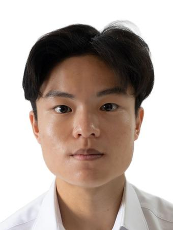
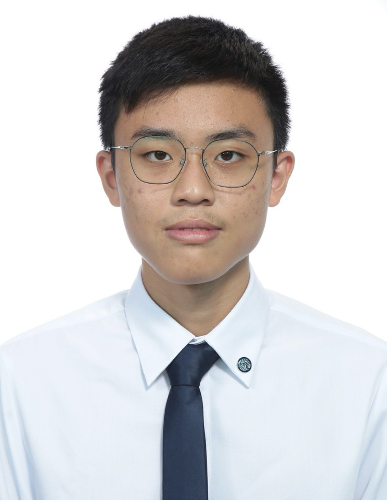
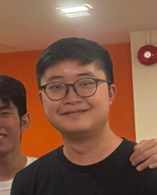
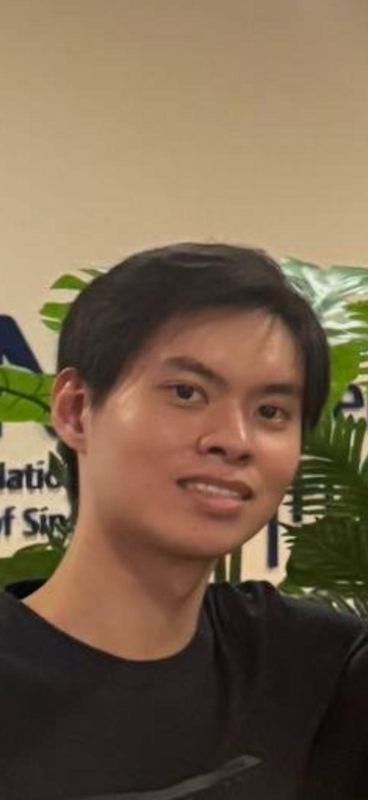

# About Us

We are a team based in the [School of Computing, National University of Singapore](http://www.comp.nus.edu.sg).

You can reach us at the email `seer[at]comp.nus.edu.sg`

## Project team

### Chan Weibin

[[github](https://github.com/aintnoweii)]

### Jane Doe

[[github](http://github.com/johndoe)]
[[portfolio](team/johndoe.md)]

* Role: Team Lead
* Responsibilities: UI

### Chaw Qi Xuan

[[github](http://github.com/YourHand29)] 
[[portfolio](team/johndoe.md)]

* Role: Developer
* Responsibilities: Data

### Ang Ee Yang

[[homepage](https://github.com/eeyang2026/tp)]
[[github](https://github.com/eeyang2026)]

* Role: Developer
* Responsibilities: Dev Ops + Threading

### Darren Song

[[github](http://github.com/nerrad2004)]
[[portfolio](team/johndoe.md)]

* Role: Developer
* Responsibilities: UI
